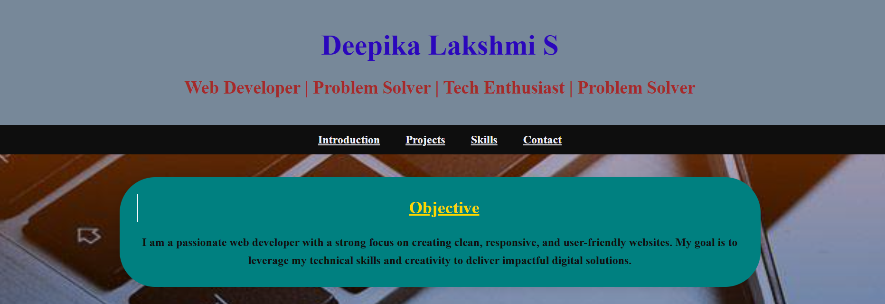
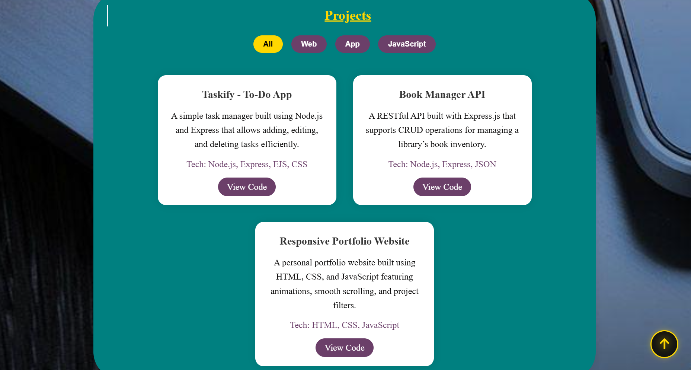
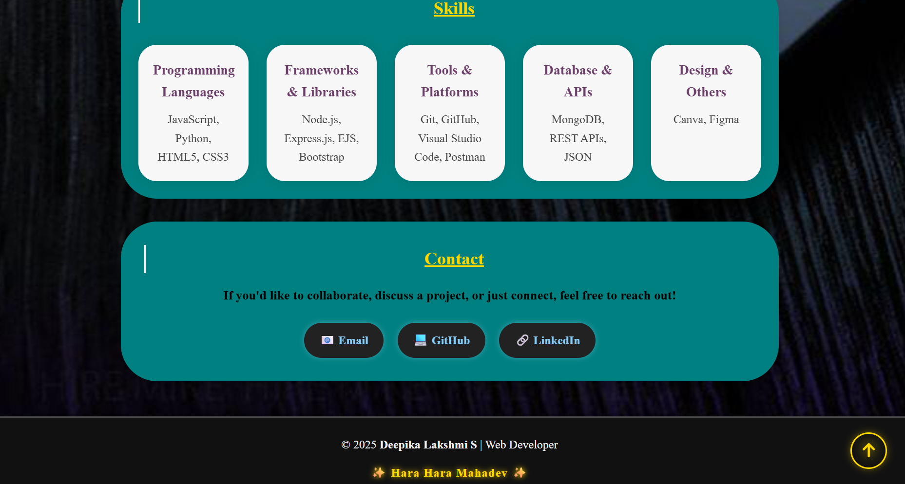

# 🌐 Deepika Lakshmi S | Portfolio Website

<p align="center">
  <a href="https://Deepu0808.github.io" target="_blank">
    
  </a>
</p>


Welcome to my **personal portfolio website**, a creative showcase of my journey as a **Web Developer**, **Problem Solver**, and **Tech Enthusiast**.  
This site highlights my **projects**, **skills**, and **contact information**, built using **HTML, CSS, and JavaScript** with a focus on **responsive design** and **user experience**.

---

## 🚀 Live Demo
🔗 **View My Portfolio:** [https://Deepu0808.github.io](https://Deepu0808.github.io)

---

## 🖼️ Website Preview

Below are a few snapshots of my live website 👇  

| Section | Screenshot |
|----------|-------------|
| 🏠 **Home / Objective** |  |
| 💻 **Projects** |  |
| 🧠 **Skills** |  |


---

## 🛠️ Tech Stack

| Category | Tools & Technologies |
|-----------|----------------------|
| 💻 **Frontend** | HTML5, CSS3, JavaScript |
| 🎨 **Styling & Design** | Custom CSS, Flexbox, Animations |
| ⚙️ **Frameworks / Libraries** | Node.js, Express.js (for projects) |
| 🧰 **Tools & Platforms** | Git, GitHub, VS Code, Postman |
| 🗄️ **Database / APIs** | MongoDB, REST APIs, JSON |
| 🧩 **Design Tools** | Canva, Figma |

---

## ✨ Features

✅ **Fully Responsive Design** — adapts beautifully to all devices  
✅ **Smooth Scroll & Section Animations** — powered by CSS & JS  
✅ **Project Filtering** — easily view projects by category  
✅ **Scroll-to-Top Button** — quick navigation  
✅ **Interactive UI** — engaging and clean visual layout  
✅ **Contact Links** — connect via Email, GitHub, or LinkedIn

---

## 📂 Folder Structure


```bash
Deepu0808.github.io/
│
├── index.html           # Main HTML structure
├── style.css            # Custom styles and animations
├── script.js            # Interactive JavaScript logic
├── screenshots/         # Folder containing screenshots
│   ├── home.png
│   ├── projects.png
│   └── skills.png
└── README.md            # Project documentation (this file)
